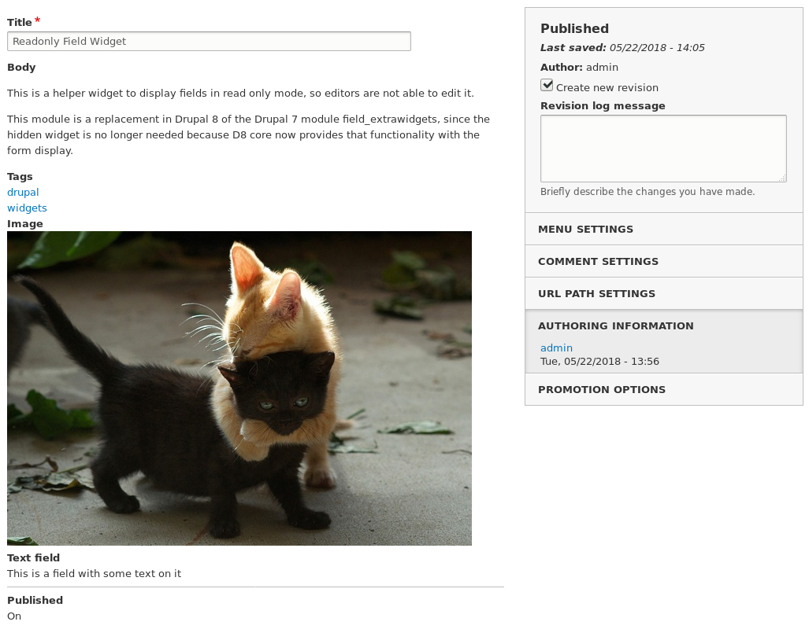

# Readonly Field Widget

This is a Drupal 8 module providing a field widget which shows the content of
the field on the edit form, but doesn't allow the user to edit it. The content
is rendered using the default formatter of the field.

This module has nothing to do with access to the content or permissions on
fields. It only affects the way the edit form is displayed, in case you want
editors to be able to see the value of a current field, but not allow them to
change it.

In the Manage form display tab you can choose the readonly widgets for the
field or fields you want:

This is how the Edit page looks like with readonly widgets.

