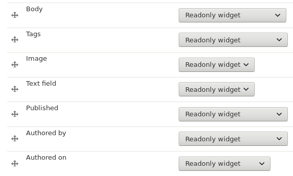

# Readonly Field Widget

This is a Drupal 8 module providing a field widget which shows the content of the field on the edit form, but doesn't allow the user to edit it. The content is rendered using the default formatter of the field.

In the Manage form display tab you can choose the reaonly widgets for the field or fields you want:

This is how the Edit page looks like with readonly widgets.

